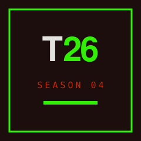
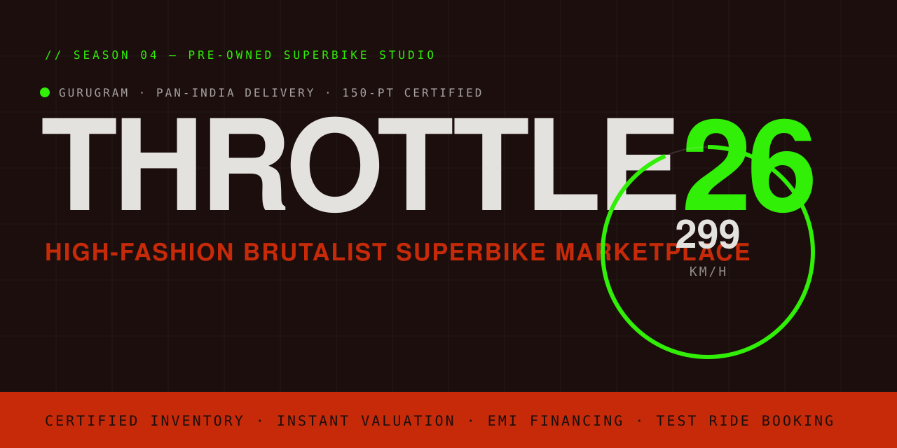
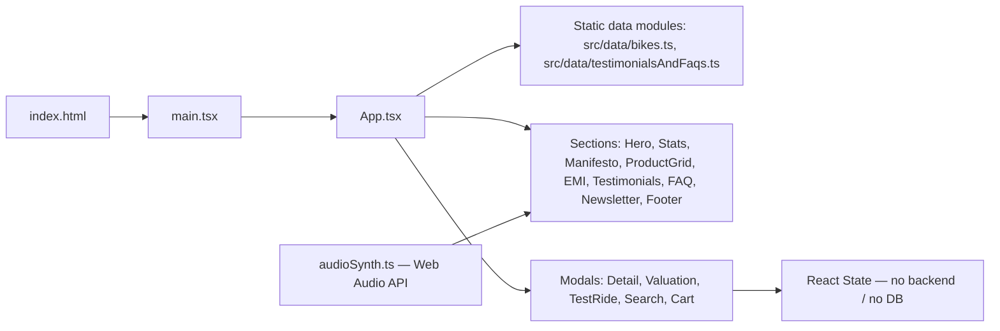
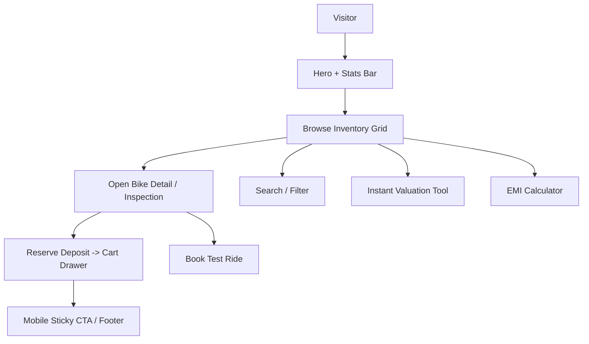

<div align="center">



# THROTTLE26

### Season 04 — High-Fashion Brutalist Pre-Owned Superbike Studio

A single-page web studio for buying, valuing, and financing certified pre-owned superbikes. Built as a client-rendered **React + TypeScript + Vite + Tailwind CSS** application with a distinctive brutalist editorial design system.

<!-- 


 -->

[Overview](#project-overview) • [Key Features](#key-features) • [Architecture](#architecture) • [Installation](#installation) • [Tech Stack](#technology-stack) • [License](#license)

</div>

<p align="center">
  
</p>

---

## Project Overview

**THROTTLE26** is a front-end web studio that presents a curated, *150-point certified* inventory of pre-owned superbikes in a high-fashion, brutalist editorial layout. The experience is designed to feel like a digital showroom: a full-screen hero, a trust/stats bar, a brand manifesto, an asymmetric filterable product grid, interactive financing tools, and a suite of modal workflows for valuation, test-ride booking, search, and deposit holds.

The application is a **static, client-rendered single-page application (SPA)**. All product data, testimonials, and FAQs are defined in typed local modules (`src/data/`), and every interactive tool — valuation, EMI calculator, deposit cart — is computed in the browser. No backend server or database is included in the current source tree.

> **Note on identity:** The repository directory is named `throttle36`, while the application manifest (`metadata.json`) and page title identify the product as **THROTTLE26 — Season 04 Superbike Studio**. This README uses the product name **THROTTLE26**.

## Problem Statement

```
The Problem
↓
Buying a pre-owned superbike is high-risk: condition is opaque,
documentation is inconsistent, and most listings feel transactional.

Why Existing Approaches Are Limited
↓
Generic classifieds show photos but not certified inspection data,
offer no instant valuation, and provide no financing or test-ride path.

Our Approach
↓
A studio-grade interface that leads with a 150-point inspection
report per machine, pairs it with instant valuation, EMI math,
and test-ride booking — all in one brutalist, trust-forward UI.

The Result
↓
A buyer can explore certified inventory, verify condition, estimate
value, model a loan, and reserve a machine — without leaving the page.
```

## Key Features

### Inventory & Discovery
- **Filterable product grid** — live filtering by keyword, brand, price range, minimum year, engine displacement, and listing status (`src/components/ProductGrid.tsx`).
- **150-point certified inspection reports** — each superbike carries a structured, category-scored inspection dossier rendered in a detail lightbox (`src/data/bikes.ts`, `src/components/SuperbikeDetailModal.tsx`).
- **Full-text search modal** — quick lookup across the inventory with direct navigation to a machine (`src/components/SearchModal.tsx`).

### Financing & Transactions
- **Interactive EMI / loan calculator** — models monthly EMI, down payment, total interest, and tenure from price, rate, and term (`src/components/EmiCalculatorSection.tsx`).
- **Instant valuation engine** — estimates a resale range for a seller's bike from brand, year, odometer, and condition (`src/components/ValuationModal.tsx`).
- **Reserve / hold-deposit cart drawer** — holds a machine with a fixed 25,000 token deposit and manages reservations (`src/components/CartDrawer.tsx`).
- **Test-ride booking modal** — schedules a test ride for a specific model or the full catalogue (`src/components/TestRideModal.tsx`).

### Sensory & Brand Experience
- **Web Audio engine synthesizer** — generates distinct Inline-4, V4, and Crossplane-4 rev sounds at runtime via the Web Audio API, with a short tap and a 5-second hover rev (`src/utils/audioSynth.ts`).
- **Brutalist editorial design system** — beige canvas (`#E3E2DE`), near-black ink (`#1B0E0D`), hazard red (`#C72A09`), and neon-green accent (`#31EF07`), with sharp borders, marquee ribbons, and an SVG noise overlay.
- **Motion-driven UI** — scroll reveals, marquee animations, and modal transitions built on `motion` (Framer Motion).
- **Responsive layout** — desktop showroom grid with a sticky mobile call-to-action bar for booking and test rides.

## Technology Stack

### Frontend
- **React 19** — component-based UI (function components + hooks).
- **TypeScript 5.8** — typed components, data models, and props.
- **Vite 6** — dev server, HMR, and production bundling (`@vitejs/plugin-react`).
- **Tailwind CSS v4** — utility-first styling via `@tailwindcss/vite`.
- **Motion (Framer Motion) 12** — animations and transitions.
- **lucide-react** — icon set.

### Tooling & Runtime
- **`dotenv`** — environment loading for the AI Studio / Cloud Run runtime.
- **`tsx`** — TypeScript execution for tooling.
- **ESBuild / PostCSS / Autoprefixer** — build pipeline support.

### Declared but not yet wired into the committed source
The `package.json` also lists **`express`** and **`@google/genai`** (Google Gemini). The application manifest (`metadata.json`) declares a `MAJOR_CAPABILITY_SERVER_SIDE_GEMINI_API`. As of the current source tree, **no server code or Gemini integration is committed** — the shipped frontend is fully client-side. See [Known Limitations](#known-limitations) and [Roadmap](#roadmap).

## Architecture

THROTTLE26 is a stateless client-rendered SPA. `App.tsx` owns the top-level UI state (selected bike, open modals, deposit cart) and composes presentational sections. Data flows from static typed modules into components; user actions mutate React state only — there is no network or persistence layer.



## Application Flow



## Preview

A live product screenshot set is **not included in the repository**. The banner above (`assets/banner.svg`) is the project's visual identity. To see the full interface, run the dev server (see [Installation](#installation)) — the app renders a complete hero, inventory grid, calculators, and modals in the browser.

## Installation

### Prerequisites
- **Node.js** 18+ (the toolchain uses Vite 6 and `tsx`).
- **npm** (ships with Node).

### Clone
```bash
git clone https://github.com/unkown812/throttle26
cd throttle36
```

### Install Dependencies
```bash
npm install
```

### Run the Dev Server
```bash
npm run dev
```
The app starts on `http://localhost:3000` (Vite is configured with `--port=3000 --host=0.0.0.0`). Open that URL to view the studio.

### Production Build
```bash
npm run build      # outputs to dist/
npm run preview    # serves the production build locally
```

### Lint / Type Check
```bash
npm run lint       # runs tsc --noEmit
```

## Environment Configuration

The project targets **Google AI Studio / Cloud Run** deployment. Environment variables are documented in `.env.example`:

```env
# GEMINI_API_KEY: Required for Gemini AI API calls.
# AI Studio automatically injects this at runtime from user secrets.
GEMINI_API_KEY="MY_GEMINI_API_KEY"

# APP_URL: The URL where this applet is hosted (Cloud Run service URL).
# Used for self-referential links, OAuth callbacks, and API endpoints.
APP_URL="MY_APP_URL"
```

> **Security:** `.env*` files are git-ignored (except `.env.example`). Never commit real keys. In the current source, these variables are **not yet consumed** by any committed code (see [Known Limitations](#known-limitations)).

## Usage

1. Open the running app at `http://localhost:3000`.
2. **Explore** the inventory grid; use the filter bar (brand, price, year, engine CC, status) or the search icon in the navigation.
3. **Inspect** a machine — click a card to open the detail lightbox with its 150-point inspection report, specs, and gallery.
4. **Hear it** — tap a card or hover to trigger the synthesized engine rev (Inline-4 / V4 / Crossplane-4).
5. **Finance** — open the EMI calculator to model a loan, or the valuation tool to estimate a resale price for your own bike.
6. **Reserve** — place a 25,000 hold deposit via the cart drawer, or book a test ride from any bike or the sticky mobile bar.

## Backend, API & Database

The current repository is **frontend-only**:

- There is **no REST/GraphQL API**, no server routes, and no database schema in the committed source.
- All data (`SUPERBIKES`, `TESTIMONIALS`, `FAQ`) is defined as static TypeScript modules under `src/data/`.
- Form submissions (valuation, test-ride, deposit) update React state only and are **not** persisted or transmitted.

`express` and `@google/genai` are declared dependencies intended for a future server-side Gemini capability (per `metadata.json`), but no implementation exists yet.

## Project Structure

```text
throttle36/
├── assets/
│   ├── banner.svg              # Project banner (created for this README)
│   └── logo.svg                # Project logo mark
├── src/
│   ├── components/
│   │   ├── Navigation.tsx          # Sticky nav + search/cart/valuation triggers
│   │   ├── HeroSection.tsx         # Full-screen hero
│   │   ├── StatsBar.tsx            # Trust metrics strip
│   │   ├── ManifestoSection.tsx    # 12-column brand manifesto
│   │   ├── CategoryDivider.tsx     # Marquee ribbon dividers
│   │   ├── ProductGrid.tsx         # Filterable inventory + rev simulator
│   │   ├── SuperbikeDetailModal.tsx# Inspection lightbox
│   │   ├── EmiCalculatorSection.tsx# Loan / EMI calculator
│   │   ├── ValuationModal.tsx      # Instant valuation tool
│   │   ├── TestRideModal.tsx       # Test-ride booking
│   │   ├── SearchModal.tsx         # Full-text search
│   │   ├── CartDrawer.tsx          # Deposit hold cart
│   │   ├── TestimonialsSection.tsx # Verified rider reviews
│   │   ├── FaqSection.tsx          # FAQ accordion
│   │   ├── NewsletterSection.tsx   # Newsletter capture
│   │   ├── ContactFooter.tsx       # Footer + ghost brand banner
│   │   ├── MobileStickyCta.tsx     # Mobile booking bar
│   │   ├── TextureOverlay.tsx      # SVG noise overlay
│   │   └── NeonBadge.tsx           # Accent badge
│   ├── data/
│   │   ├── bikes.ts                # Certified inventory + inspection reports
│   │   └── testimonialsAndFaqs.ts  # Testimonials + FAQ content
│   ├── utils/
│   │   └── audioSynth.ts           # Web Audio engine synthesizer
│   ├── types.ts                   # Shared TypeScript models
│   ├── App.tsx                    # Root component / state owner
│   ├── main.tsx                   # React entry
│   └── index.css                  # Tailwind + brutalist base styles
├── index.html                     # HTML shell + font links
├── metadata.json                  # AI Studio applet manifest
├── vite.config.ts                 # Vite + Tailwind + path alias (@/)
├── tsconfig.json                  # TypeScript config
├── package.json
└── .env.example
```

## Design & UX

- **Aesthetic** — high-fashion brutalist: oversized display type, monospace technical labels, hard edges (`border-sharp`, 0px radius), and a restrained four-color palette.
- **Typography** — Clash Grotesk (display) + General Sans (body) via Fontshare, and JetBrains Mono (code/labels) via Google Fonts.
- **Motion** — `motion` powers scroll-in reveals, marquee ribbons (hover-pause), and modal transitions.
- **Texture** — a fixed SVG fractal-noise overlay (multiply blend, ~8% opacity) for print/grain feel.
- **Responsive** — fluid grids collapse to single column on mobile, with a persistent sticky CTA for booking/test rides.
- **Accessibility note** — the engine-rev audio is triggered on interaction (tap/hover) and fails silently if the browser blocks audio; no autoplay-on-load.

## Roadmap

Based on the project manifest, declared dependencies, and current gaps:

- [x] Client-side inventory studio with 150-point inspection reports
- [x] EMI calculator, instant valuation, test-ride & deposit workflows
- [x] Web Audio engine synthesizer (Inline-4 / V4 / Crossplane-4)
- [x] Brutalist responsive design system
- [ ] **Server-side Gemini API integration** (`@google/genai` declared, not implemented) — AI-assisted valuation, chat, or listing copy
- [ ] **Express backend** (`express` declared, not implemented) — persist leads, reservations, and valuations
- [ ] **Persistent data store** — replace static `src/data` modules with a real database
- [ ] **Live deployment** — publish a hosted demo URL
- [ ] **Automated test suite** — none present today (see [Testing](#testing))

## Known Limitations

- **No backend / persistence** — valuations, test-ride requests, and deposits are client-side only and are lost on refresh.
- **No automated tests** — the repository ships without a test framework or test files.
- **Declared deps unused** — `express` and `@google/genai` are installed but not referenced by committed source; `GEMINI_API_KEY` / `APP_URL` are not consumed.
- **Static inventory** — bikes, testimonials, and FAQs are hardcoded; there is no CMS or admin interface.
- **External image dependencies** — bike and avatar imagery is loaded from Unsplash URLs, so the UI requires network access to render imagery.
- **Audio support** — engine sounds rely on the Web Audio API and a user gesture; unsupported or blocked browsers will not play audio.

## Testing

Testing infrastructure is currently being developed. There is no test runner, test framework, or test file in the repository at this time. Type safety is enforced via `npm run lint` (`tsc --noEmit`).

## Deployment

The project is structured as an **AI Studio applet** intended to run on **Google Cloud Run**:

- **Build** — `npm run build` produces a static `dist/` bundle.
- **Runtime env** — `GEMINI_API_KEY` and `APP_URL` are injected by AI Studio at runtime (see `.env.example`).
- **No CI/CD config** — there are no GitHub Actions, Dockerfile, or platform config files committed.

To self-host, serve the `dist/` output with any static file server or a Node/Express static handler.

## Contributing

Contributions are welcome. This repository does not yet ship a `CONTRIBUTING.md`, `CODE_OF_CONDUCT.md`, or `SECURITY.md`; please open an issue or pull request to propose changes. Suggested areas: backend/Gemini integration, tests, and a hosted demo.

## License

No `LICENSE` file is currently present in the repository, so the project is **not licensed for reuse by default** (all rights reserved). Add a license file to clarify usage terms before publishing.

## Credits & Acknowledgements

- **Libraries** — React, Vite, Tailwind CSS, Motion (Framer Motion), lucide-react, dotenv, tsx, ESBuild.
- **Fonts** — [Clash Grotesk](https://www.fontshare.com/) & [General Sans](https://www.fontshare.com/) (Fontshare), [JetBrains Mono](https://fonts.google.com/) (Google Fonts).
- **Imagery** — motorcycle and portrait photography from [Unsplash](https://unsplash.com/).
- **Inspiration** — high-fashion editorial and brutalist web design languages.

## Support

If this project is useful or interesting to you, consider giving it a star on GitHub — it helps the studio reach more developers and riders.

